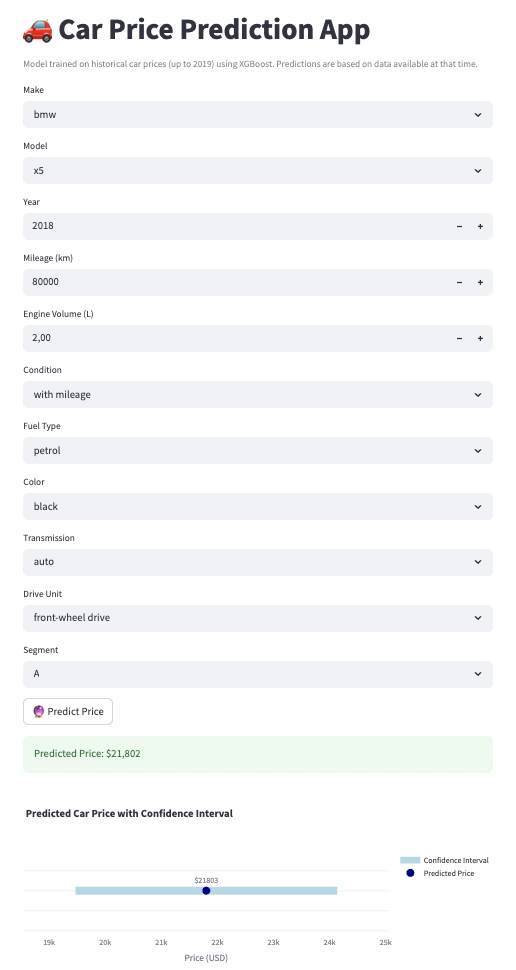

---

# 🚗 Car Price Prediction App

This project aims to build a machine learning model that predicts the market price of used cars based on key features such as make, model, year, mileage, fuel type, and more. It also includes a Streamlit web application for interactive prediction.

---

##  Project Goals

- Estimate used car prices accurately
- Provide a tool for dealerships and private sellers to evaluate car values
- Compare various machine learning models to select the best one
- Package everything into an intuitive Streamlit interface

---

##  App Preview

[View the live app on Streamlit Cloud](https://kovalivska-automotive-car-price-estimator-scriptsapp-voqcjw.streamlit.app/)  


---

##  Project Structure

```
automotive_car_price_estimator/
├── assets/                   ← Images, logos, screenshots
│   └── Screenshot_app.png
├── data/                     ← (Optional) Raw or cleaned datasets
├── models/                   ← Saved models and preprocessing
│   ├── best_model.pkl         # Final XGBoost model with log1p target
│   ├── scaler.pkl
│   ├── label_encoders.pkl
│   ├── X_train_columns.pkl
│   └── segment_rmse.csv
├── notebooks/                ← Exploratory analysis, model training
│   ├── CAR_PRICE_PREDICTION_MODEL.ipynb
│ 
├── reports/                  ← EDA results and reports
│   └── car_pricing_eda.html
├── docs/
│ └── car_pricing_eda.html # Public version for GitHub Pages
├── scripts/                  ← Streamlit application
│   └── app.py
└── requirements.txt          ← Required packages for the project
└── README.md
```

---
## Exploratory Data Analysis (EDA)

An interactive HTML report was generated as part of the data exploration phase.  
You can view the full profiling report here:

🔗 [View EDA Report](https://kovalivska.github.io/automotive_car_price_estimator/car_pricing_eda.html)

## Models Tested

The following regression models were trained and evaluated:
- 🔹 LinearRegression 
- 🔹 DecisionTreeRegressor 
- 🔹 GradientBoostingRegressor 
- 🔹 XGBoostRegressor  
- 🔹 LightGBMRegressor  
- 🔹 CatBoostRegressor 

### Metrics Used

| Model       		| MAE       | RMSE     |
|-------------------|-----------|----------|
| CatBoost    		| 1758.17   | 2968.08  |
| LightGBM    		| 1670.52   | 3039.68  |
| XGBoost     		| 1707.54   | 2935.52  |
| Linear Regression | 2077.56   | 4125.57  |
| Decision Tree 	| 2500.32   | 4419.97  |
| Gradient Boosting | 1725.61   | 3104.63  |

 **XGBoost (log-transformed target + tuning) was selected as the final model** with the lowest MAE **$1525.87** and RMSE **$2829.23**, aiming for the most consistent pricing across economy and mid-range cars.

---

##  How to Run the App

### Clone the project:
```bash
git clone https://github.com/yourusername/automotive_car_price_estimator.git
cd automotive_car_price_estimator
```

### Setup & Requirements

This project uses **Python 3.10** and **Streamlit** for building the application.  
Please ensure you are using Python 3.10 to avoid compatibility issues.

### Recommended Setup Steps:

1. Create a virtual environment with Python 3.10:
    ```bash
    python3.10 -m venv venv
    source venv/bin/activate  # On Windows use: venv\Scripts\activate
    ```

2. Install dependencies:
    ```bash
    pip install -r requirements.txt
    ```

3. Run the Streamlit app:
    ```bash
    streamlit run app.py
    `
Open your browser at: http://localhost:8501

---

## Main Packages

- `streamlit`
- `pandas`
- `numpy`
- `scikit-learn`
- `catboost`
- `lightgbm`
- `xgboost`
- `plotly`
- `matplotlib`
- `seaborn`

Install with:
```bash
pip install -r requirements.txt
```

---

##  Author

Developed by **Svitlana Kovalivska, PhD, 2025**.  
For questions, feel free to open an issue or reach out on GitHub.

---
